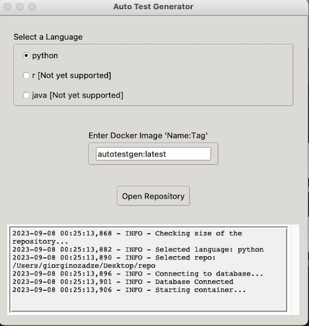
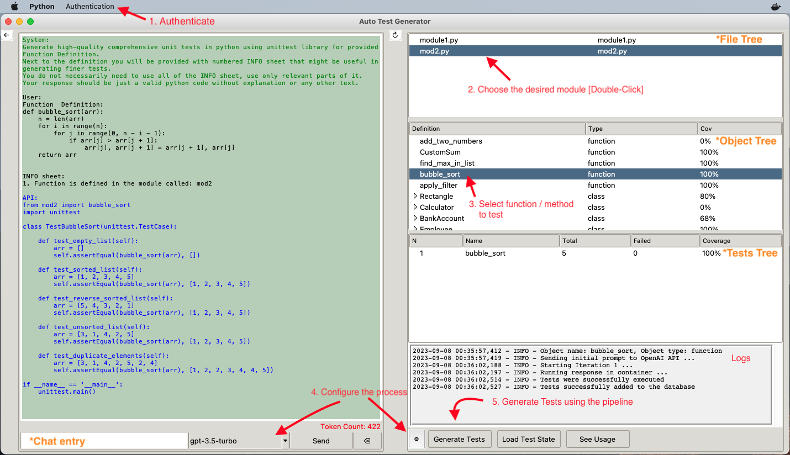
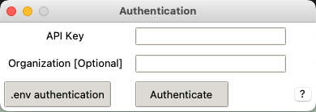
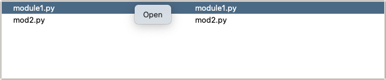
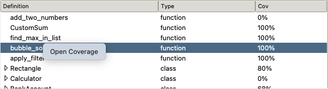
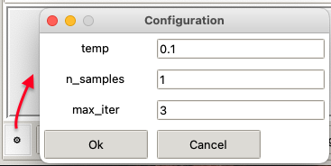
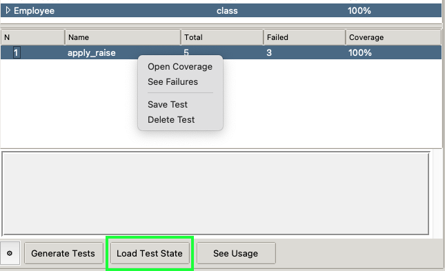
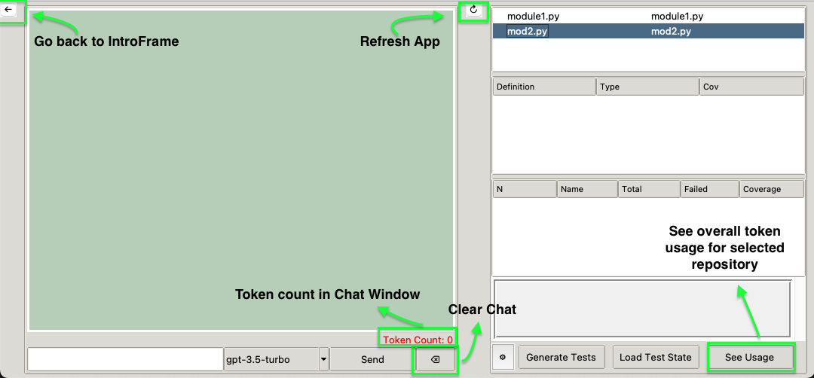

# AutoTestGen

[](https://www.en.statistik.uni-muenchen.de/index.html)
[](https://opensource.org/licenses/MIT)

## Description

AutoTestGen analyzes code segments and uses Large Language Models (OpenAI ChatCompletion endpoints) to autonomously generate unit tests. It was developed as part of the **Practical Applications for Large Language Models** seminar at LMU Munich under the guidance and supervision of Martin Binder.

## Prerequisites

Before you can use this application, make sure you have the following prerequisites installed on your system:

1. **Docker**: Ensure that you have Docker installed. You can download and install Docker from [Docker's official website](https://www.docker.com/get-started).

2. **Docker Image containing Python 3.9+**: This application requires any docker image containing Python version 3.9 or higher. It is required to provide an isolated environment to avoid executing potentially malicious code generated by the LLM on your local machine.
If you don't have your custom image already, create one as follows:

- Use provided [Dockerfile](./Dockerfile) to build a custom image, which additionally installs *coverage* package used in the application for measuring python code coverage. You are free to add other packages which the project you want to test requires. To build the image, run the following command: 
    ```sh
    docker build -t autotestgen:latest .
    ```

## Installation
To get started with the application, follow these simple installation steps:
```sh
# Clone the repository
git clone git@github.com:LMU-Seminar-LLMs/AutoTestGen.git

# Change into the project directory
cd AutoTestGen

# Install the AutoTestGen app
pip install .

# Run the application via the command line
autotestgen
```

## Usage

After starting the application **Introductory Frame** will be displayed.


1. Select the language in which your code to be tested is written in.
2. Enter the docker image *name:tag* to use.
3. Select your project directory using *Open Repository* button.

After selecting the project directory, **Main Frame** will be displayed.


1. Authenticate via the menu bar. [See Authentication](#authentication)
2. Choose the file for testing by double-clicking on it in the File Tree. [See File Tree](#file-tree)
3. Select function/method to test in the Object Tree. [See Object Tree](#object-tree)
4. Configure the test generation process. [See Test Configuration](#test-configuration)
5. Push the *Generate Tests* button to start the test generation process. [See Test Generation](#test-generation)
6. Observe results in the Tests Tree. [See Tests Tree](#tests-tree)

### Authentication
Authentication via the menu bar is required to use the OpenAI API. It opens the following window:
[](https://beta.openai.com/docs/developer-quickstart/your-api-keys)

User has an option to authenticate manually using the entries or using *.env* file containing the API key. For more information about .env authentication see the question mark in the right lower corner of the window.

### File Tree
File Tree displays all the files having the selected language extension in the project directory. It additionally ignores all the files listed in the .gitignore file if it exists.  User can select the file for testing by *double-clicking* on it.


***Additional features:***
- Right-click menu:
    - *Open* - opens the file in the default editor. It can be used for quick fixes of the code before generating the tests.


### Object Tree
Object Tree displays all the functions/methods in the selected file. Methods are displayed as children nodes of the class they belong to. User simply needs to select desired object before clicking the *Generate Tests* button.


***Additional features:***
- Right-click menu:
    - *Open Coverage* - opens the coverage report accumulated over all avaliable tests in the database for the selected object.
- *double-click* - lists all the tests in the database for the selected object in the *Tests Tree*.

### Test Configuration
Test Configuration allows the user to configure the test generation process.
- The user can select the desired model endpoint through the combobox next to the chat entry. Model can be changed at any time during the test generation process. *Default: gpt-3.5-turbo*.
- Pipeline parameters are set in the settings window:
    - 
    - *temp* - temperature parameter for the model. The higher the temperature, the more random the generated text. For higher n_samples, use higher temperature to ensure diversity in the generated samples. *Default: 0.1*
    - *n_samples* - number of samples to generate with the initial prompt. If it is larger than 1, the model will generate multiple samples which are evaluated separately and summarized in single new prompt which will generate the final single response. *Default: 1*
    - *max_iter* - maximum number of iterations to run the pipeline - automatically reprompt the model in case the generated tests cannot be compiled or contain errors. *Default: 3*

### Test Generation
Both the prompts and the generated tests will be displayed in the *Chat Window*. The user can continue communicating with the API through the *Chat Entry* as in normal chat. There is also an option to click *Generate Tests* button again for another object to perform [**few-shot learning**](https://help.openai.com/en/articles/6654000-best-practices-for-prompt-engineering-with-openai-api).  
All the messages in the *chat window* are send together with the new message to the API until the chat is cleared. [See Other Features](#other-features)  
All succesfully generated tests will be saved in the database and can be viewed in the *Tests Tree*. [See Tests Tree](#tests-tree)

### Tests Tree
Tests Tree displays all the tests in the database for the selected object. User can open the tests in a separate window by *double-clicking* on them. The user can make changes to the test there and save it to the database by clicking the *Save Changes* button.

***Additional features:***
- *Load Test State Button* - loads the test state from the database. It is useful when the user wants to continue working on the test after closing the application or after manually changing the test file. It can also be used to perform [**few-shot learning**] by loading the tests of the method of the same class before generating the tests for the other method.
- Right-click menu:
    - *Open Coverage* - opens the coverage report for the selected test.
    - *See Failures* - opens the window with the list of failures for the selected test.
    - *Save Test* - saves the test locally as a python file.
    - *Delete Test* - deletes the test from the database.
- *double-click* - opens the test in a separate window.

### Other Features


### Technical Details
- The application uses [**OpenAI ChatCompletion API**](https://beta.openai.com/docs/api-reference/chat) to generate tests.
- The application **creates a sqlite database** *autotestgen.db* in the selected project directory to store the generated tests and usage statistics. This is the only file created by the app on the local machine.
- The application performs code analysis and communication with the API on the **local machine**. It uses **docker container** to execute the generated tests and measure code coverage, returning summarized metadata in json format.
- At startup, the application **starts** the container, **mounts** the selected project directory as a **read-only** volume and **copies** *_run_tests_script.py* file to the container.
- On exit, the application **closes the database**, **stops the container and removes it.**

